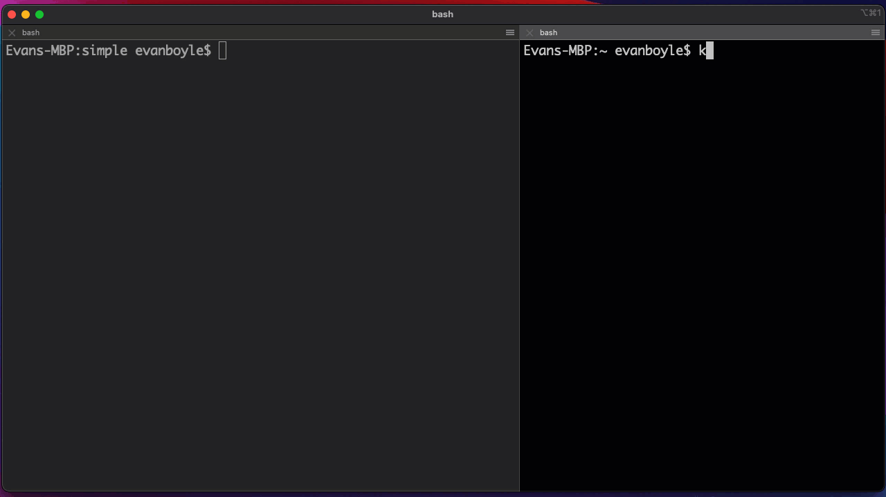

# pulumi-repl

Create cloud infrastructure and explore pulumi in an interactive NodeJS REPL.

1. Create and explore cloud infrastructure.
2. Run `apply` and experiment with other pulumi functionality.
3. Save your work as a full pulumi program when you're done with `eject`!
4. Create ephemeral sessions that automatically delete all resources on `ctrl+c`.

Just a few lines of code to get started:
```ts
import { PulumiRepl } from "pulumi-repl";

const repl = new PulumiRepl({
    stack: "dev",
    project: "pulumi-repl",
    eject: true, // save my work at the end in ./eject
    config: {
        "aws:region": { value: "us-west-2" }
    },
});

repl.start().catch(err => console.error(err));
```

## Demos

### Kubernetes

Create kubernetes resources interactively!



### Eject

When you're done with your REPL, you can eject a pulumi program generated from all the commands you entered. Here we create a static S3 website. At the end our program is ejected in `./eject`. When we run a preview on that program, we see that there's no diff!


## Usage && Requirements

### Prereqs:

1. Pulumi CLI logged in and configured: https://www.pulumi.com/docs/get-started/
2. Cloud credentials configured as per above guide (for your cloud of choice).

### Basic

```ts
import { PulumiRepl } from "pulumi-repl";

// configure the REPL
const repl = new PulumiRepl({
    stack: "dev", // you Pulumi stack name, where your infrastructure state gets stored
    project: "pulumi-repl", // top level pulumi project
    config: { // any config that might be required by your cloud provider
        "aws:region": { value: "us-west-2" }
    },
});

// start execution, ctrl+c to exit
repl.start().catch(err => console.error(err));
```

### Registering Stack Outputs in the REPL

The REPL has a builtin function `registerOutput(k, v)` which creates stack exports.

```sh
$ pulumi-repl> registerOutput("websiteUrl", siteBucket.websiteEndpoint);

...
Outputs:
    websiteUrl: "s3-website-bucket-82db68d.s3-website-us-west-2.amazonaws.com"
```

### Eject
`eject` will output a full pulumi program into the `./eject` directory including:
- index.js (program)
- pacakge.json
- Pulumi.yaml (your project file)

```ts
const repl = new PulumiRepl({
    eject: true // save your work in ./eject at the end
    stack: "dev",
    project: "pulumi-repl",
    config: {
        "aws:region": { value: "us-west-2" }
    },
});

To run your program:
```sh
$ cd ./eject
$ yarn install
$ pulumi stack select # pick the stack you want to work with
$ pulumi config set ... # set any cloud provider config values if needed
$ pulumi preview # see your program in action
```

### Plugins and Context

The REPL comes preloaded with the following Pulumi provider plugins:

- AWS
- Azure (native)
- GCP 
- Kubernetes

You can add additional provider plugins and SDKs as described below.

The REPL supports defining context values via `this.addContext(k, v)`, which we use to load the `random` resource provider SDK below. In addition, we access the Automation API stack object to install plugins.

```ts
import { PulumiRepl } from "pulumi-repl";
// import a custom pulumi provider SDK.
import * as random from "@pulumi/random";

const repl = new PulumiRepl({
    stack: "dev",
    project: "pulumi-repl-custom",
});

// make the random SDK accessible to the repl at runtime
repl.addContext("random", random);

// access the automation api stack to install provider plugins
repl.stack.then(s => {
    // install the 'random' resource provider plugin
    s.workspace.installPlugin("random", "v4.0.0").then(()=>{
        repl.start().catch(err => console.error(err));
    })
});
```

### Ephemeral Stacks

Specify the `ephemeral: true` arg to run the repl in ephemeral mode. On `ctrl+c` all of your cloud resources will be cleaned up and destroyed.

```ts
import { PulumiRepl } from "pulumi-repl";

const repl = new PulumiRepl({
    stack: "dev",
    project: "pulumi-repl-custom",
    ephemeral: true // delete the resources created during this session with ctrl+c
});
```

### Automation API Stack & Workspace
If you're an advanced Pulumi user, you may want to access the Automation API Stack. You can do this via `this.stack` (a promise). 

You can access the underlying `LocalWorkspace` via `this.stack.then(s => s.workspace)`. 

Advanced workspace configuration options are available including custom backends (azure, filestate, etc), and custom secrets providers via `ReplArgs.workspaceOpts`
## How it works

This library uses the native NodeJS REPL library and the [Pulumi Automation API](https://www.pulumi.com/docs/guides/automation-api/) (OSS) which turns the Pulumi IaC engine into an embeddable SDK. 